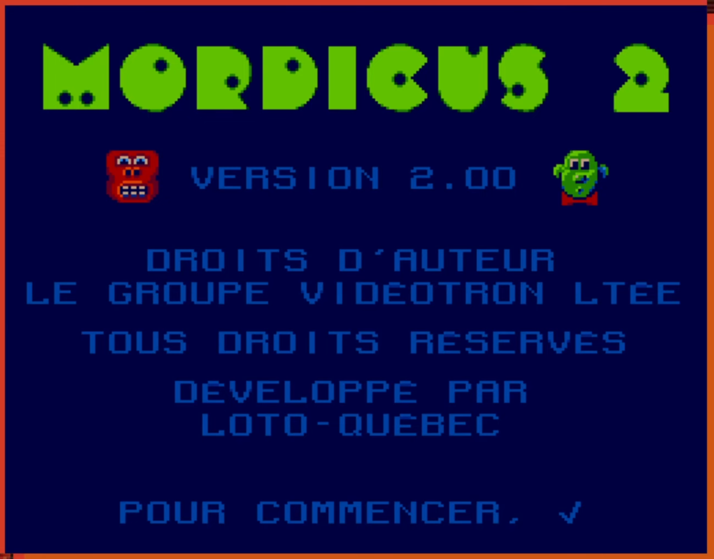
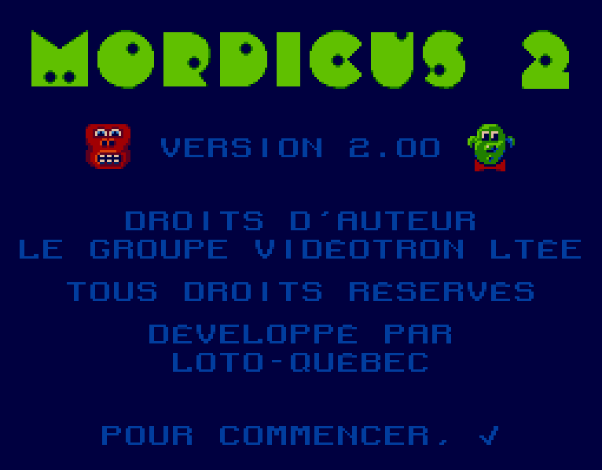
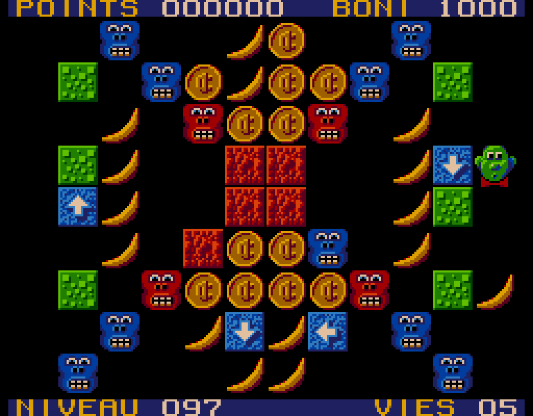
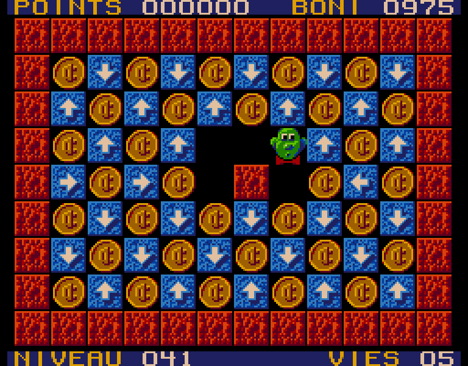

# 🐵 Mordicus 2 🍌

### Reproduction en JavaScript du jeu Mordicus 2

Ce projet est une reproduction de Mordicus 2, un jeu développé par Loto-Québec paru au courant des années 1990 sur le terminal de [Vidéoway](https://fr.wikipedia.org/wiki/Vid%C3%A9oway). Le code source du jeu étant perdu, il est désormais impossible d'y jouer dans sa version originale.

Cette reproduction a été rendue possible grâce à l'excellent travail de Maxime de la chaîne YouTube [Des Jeux pis d'la Bière](https://youtube.com/@jeuxbiere?feature=shared). Les 240 niveaux du jeu "frère" [Mozaic](https://youtu.be/YygmFM3qP8w?feature=shared), que Maxime a [répertoriés et archivés](https://archive.org/details/mozaic-240-levels/001.png), sont inclus dans ce projet. Quelques niveaux ont été déplacés, notamment les niveaux [148](https://archive.org/details/mozaic-240-levels/148.png), [142](https://archive.org/details/mozaic-240-levels/142.png) et [143](https://archive.org/details/mozaic-240-levels/143.png) qui sont positionnés au tout début puisque ce sont les 3 premiers niveaux connus du jeu original Mordicus 2. La copie des niveaux fut une tâche longue et abrutissante, il est très probable que j'ai fait des erreurs. Si vous en repérez, veuillez m'en informer.

## Installation

Fonctionne uniquement sous Windows.
Vous pouvez générer l'installateur avec les commandes suivantes:

```sh
npm install
npm run make
```

Cherchez ensuite le fichier d'installation nommé "Mordicus 2 - Setup.exe" dans le dossier ./out/make.

## Contrôles

Mordicus se dirige avec les flèches du clavier,
Appuyez sur _Espace_ ou _Entrée_ pour le caractère ✓,
Faites la touche _Échapper_ à tout moment pour abandonner et recommencer le niveau.

Fonctionne également avec une manette de jeu (testé avec une manette de Xbox).

Les meilleurs pointages pour chacun des niveaux et le code d'accès du dernier niveau joué sont sauvegardés en localStorage, ils persistent après la fermeture de l'application.

## Travail restant...

La fin du jeu est bâclée. Si quelqu'un complète les 240 niveaux ou si je trouve le temps, je retravaillerai l'écran de fin.

## Captures

Écran titre du jeu original:

<p align="center"></img></p>

Captures de la reproduction:

<p align="center"></img></p>

<p align="center"></img></p>

<p align="center"></img></p>
