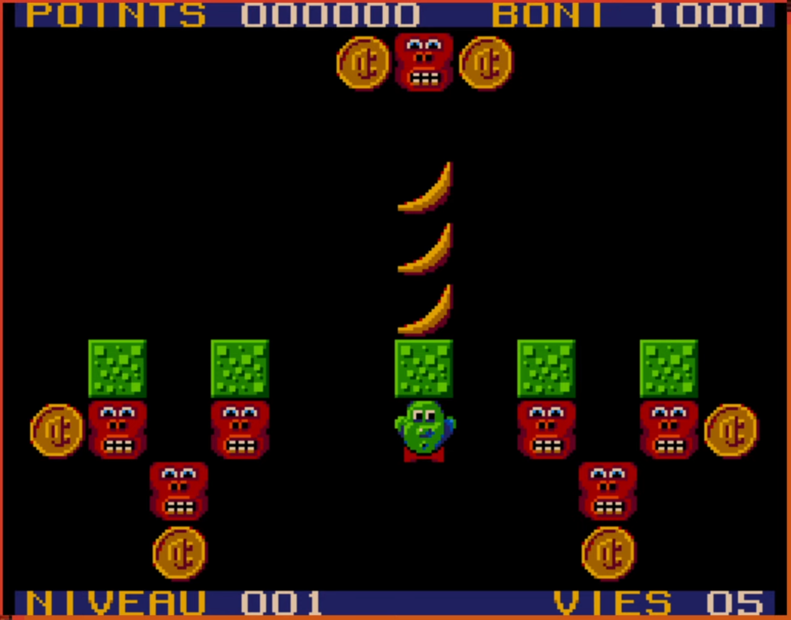
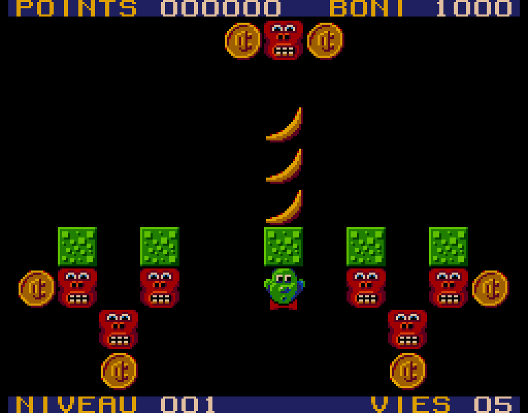

# 🐵 Mordicus 🍌

### Reproduction en JavaScript du jeu Mordicus

Ce projet est une reproduction de Mordicus, un jeu développé par Loto-Québec paru au courant des années 1990 sur le terminal de [Vidéoway](https://fr.wikipedia.org/wiki/Vid%C3%A9oway). Le code source du jeu serait aujourd'hui perdu ou du moins inaccessible.

Cette reproduction a été rendue possible grâce à l'excellent travail de Maxime de la chaîne YouTube [Des Jeux pis d'la Bière](https://youtube.com/@jeuxbiere?feature=shared). Les 240 niveaux du jeu frère [Mozaic](https://youtu.be/YygmFM3qP8w?feature=shared), que Maxime a [répertoriés et archivés](https://archive.org/details/mozaic-240-levels/001.png), sont inclus dans ce projet. Quelques niveaux ont été déplacés, notamment les niveaux [148](https://archive.org/details/mozaic-240-levels/148.png), [142](https://archive.org/details/mozaic-240-levels/142.png) et [143](https://archive.org/details/mozaic-240-levels/143.png) qui sont positionnés au tout début puisque ce sont les 3 premiers niveaux connus du jeu original Mordicus (version 2). Si vous repérez des erreurs de recopie des niveaux, veuillez m'en informer.

## Installation

Le jeu est hébergé sur itch.io à l'adresse [https://bouc1620.itch.io/mordicus](https://bouc1620.itch.io/mordicus). Il vous est possible d'y jouer directement dans votre navigateur ou sur votre ordinateur en téléchargeant le fichier d'installation Electron.

La task pour générer l'installateur existe seulement pour Windows. Générez l'installateur Electron avec la task "make". Un fichier d'installation nommé "Mordicus - Setup.exe" sera créé dans le dossier ./out/make. Les niveaux sont conservés dans des grilles à l'intérieur d'un fichier JSON, avec un peu de travail il vous est possible de créer et jouer vos propres niveaux.

## But du jeu

Faites disparaître toutes les bananes et amassez toutes les pièces pour réussir le niveau. Bien entendu, Mordicus doit s'en tirer indemne!

## Contrôles

Mordicus se dirige avec les flèches du clavier.
Appuyez sur _Espace_ ou _Entrée_ pour le caractère ✓.
Faites la touche _Échap_ à tout moment pour abandonner et recommencer le niveau.
En mode facile, cette reproduction comporte une fonction "undo/redo" qui annule ou réexécute un coup. Utilisez la avec les touches _Z_ et _Y_.

Fonctionne également avec une manette de jeu (développé avec une manette de Xbox).

Le jeu sauvegarde en localStorage les meilleurs pointages (les "BONI" les plus élevés) obtenus pour chacun des niveaux ainsi que le code d'accès du niveau le plus élevé que vous aurez atteint. La saisie d'un nouveau code d'accès remplace l'ancienne valeur.

## Captures

Premier niveau du jeu original:

</img>

Captures de la reproduction:

</img>

</img>

</img>

